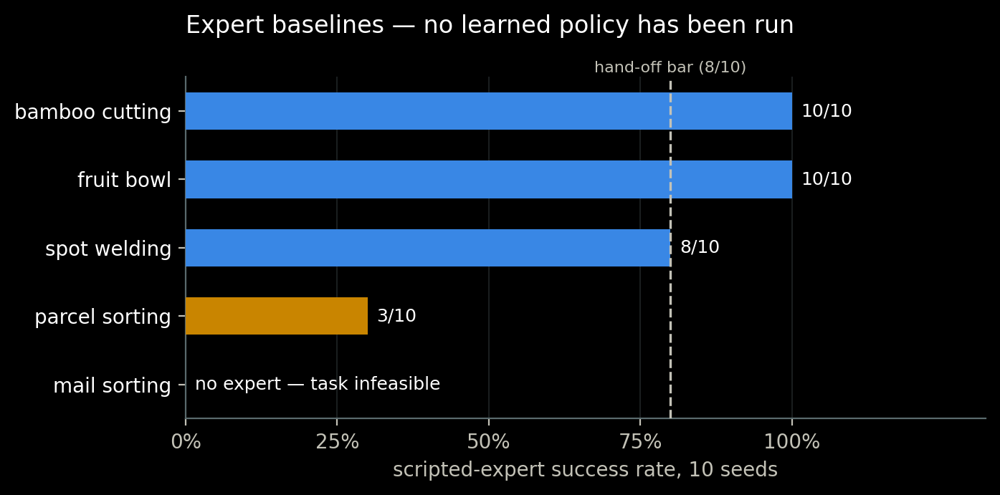
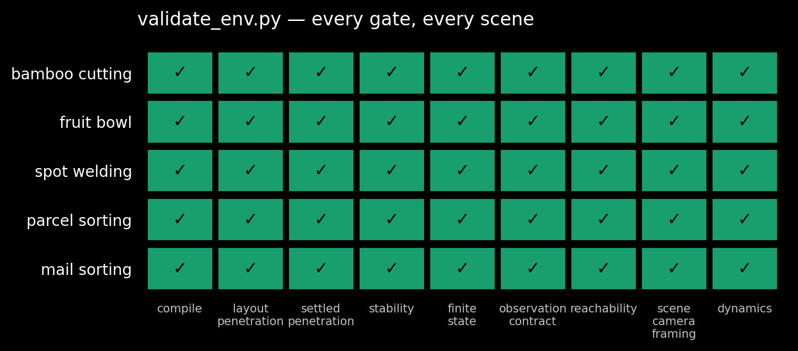
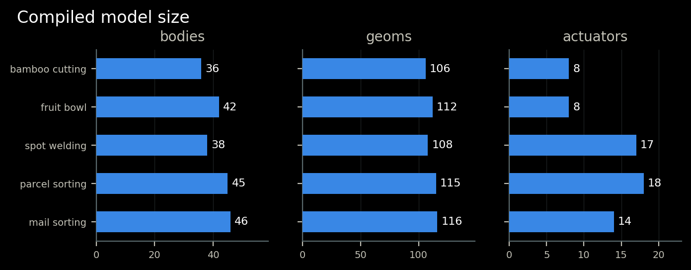
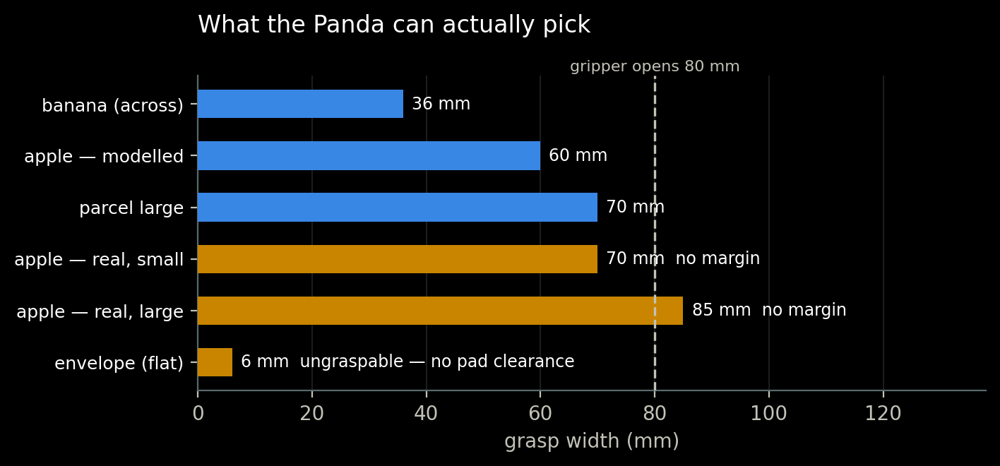
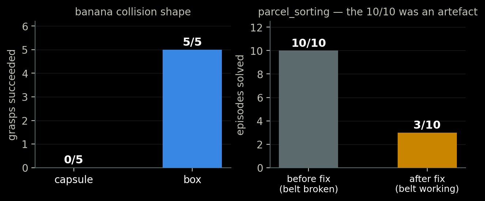
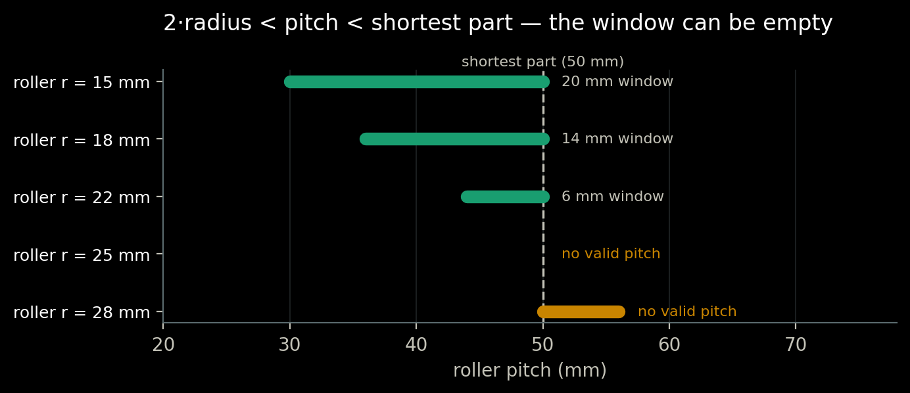
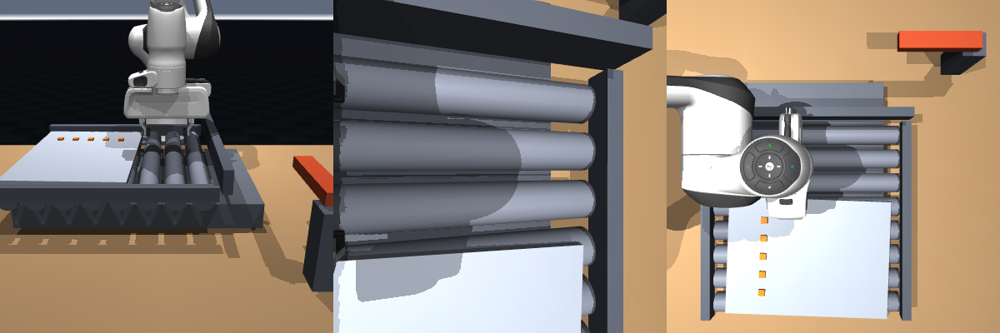
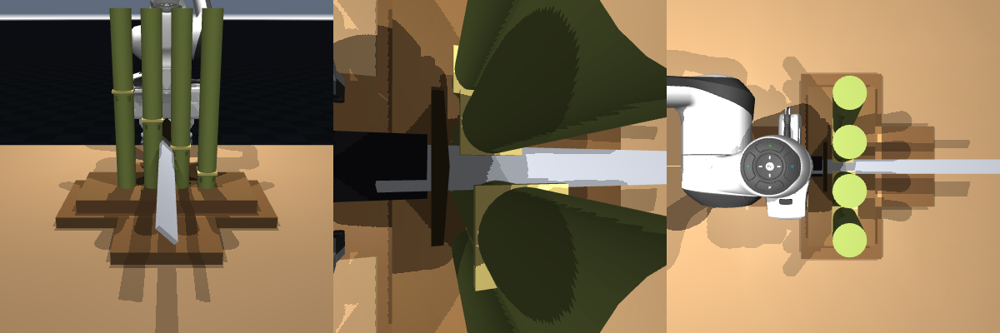
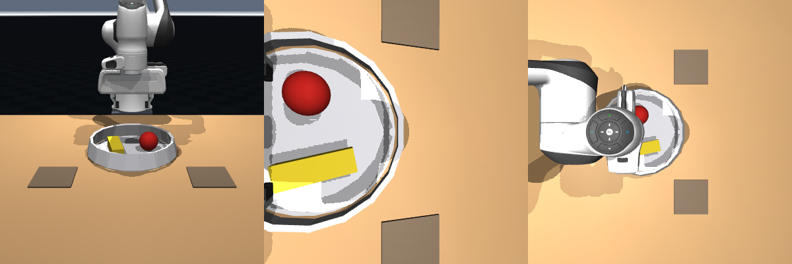

## What this is — and what it is not

\alert{No learned policy has been evaluated.} `pi0.5` has never been run against any
of these scenes.

The four-stage pipeline:

\scriptsize
| stage | skill | status |
| :--- | :--- | :--- |
| 0 | `robo-env-create` | **built** — Blender authoring $\rightarrow$ MuJoCo, validated |
| 1 | `robo-policy-deploy` | stub — contract written, automation not |
| 2 | `robo-task-define` | partly — predicates + scripted experts exist |
| 3 | `robo-eval` | stub |
\normalsize

What follows are **scripted-expert baselines**: the ceiling a learned policy would
later be measured against. They say a task is solvable and by how much margin.
They say nothing about whether a policy can do it.

## Five scenes, all authored through the same pipeline

\scriptsize
| scene | task | moving parts |
| :--- | :--- | :--- |
| `mail_sorting` | sort envelopes by size into bins | roller conveyor |
| `parcel_sorting` | sort parcels by size into bins | roller conveyor |
| `spot_welding` | weld a flange seam in sequence | conveyor + cycling clamp |
| `bamboo_cutting` | cut a bamboo row with one katana stroke | 4 severable weld joints |
| `fruit_bowl` | take fruit out of a bowl and put it back | none |
\normalsize

Each is one `spec.json`, compiled by `mrs.envs.scenegen`, preserving the observation
and action contract of the hand-written reference — so released `pi0.5` checkpoints
load without an adapter.

## Expert baselines

Two scenes fall short of the 8/10 hand-off bar the skill requires, and one has no
expert at all.

## Every gate, every scene

\scriptsize
`validate_env.py` is the gate between authoring and evaluation. Each check exists
because that failure actually happened during the build.
\normalsize

## Compiled model size

\scriptsize
The scenes are comparable in size; complexity lives in the dynamics and the
constraints, not the geometry count.
\normalsize

## Finding 1 — the gripper decides the task

\scriptsize
A real apple (70–85 mm) does not fit an 80 mm gripper with usable margin, so
`fruit_bowl` models a 60 mm one. A flat envelope cannot be picked at all: the
finger pads are centred on the grip site, leaving nowhere to go but into the table.
`mail_sorting` \alert{validates perfectly and is unsolvable} — kept deliberately
as the worked example of that distinction.
\normalsize

## Finding 2 — two measurements that changed a scene

\scriptsize
**Left:** a capsule against a flat finger pad makes one contact point per side and
rotates straight out. The banana is now an invisible box collision core with a
non-colliding capsule shell — box physics, banana appearance.

**Right:** `parcel_sorting` reported 10/10 for most of this work. The conveyor was
silently transporting nothing, so the parts never moved and the task was far easier
than intended.
\normalsize

## Finding 3 — a constraint window that can be empty

\scriptsize
$2 \times \text{radius} < \text{pitch} < \text{shortest part}$. Below the lower bound
adjacent rollers intersect; above the upper bound the part sits cradled in a valley
and the belt slides underneath it. At radius 25 mm against a 50 mm part
\alert{no pitch satisfies both} — the only fix is a smaller roller.
\normalsize

## Library defects found by building scenes

\scriptsize
| defect | symptom | caught by |
| :--- | :--- | :--- |
| free-body orientation discarded on reset | banana modelled lying down spawned upright, inside the desk | `fruit_bowl` |
| nested bodies got the parent transform twice | drawer landed 750 mm from its authored pose | fidelity audit |
| mesh OBJs exported in world space | mesh rendered at exactly $2\times$ its position | fidelity audit |
| `add_box` silently produced a 1 m cube | huge inertia on the wrist dragged the arm down | katana |
| `decor` was collidable despite the docs | table legs joined the contact solve | fidelity audit |
| conveyor transported nothing | roller pitch wider than the part | `validate_env.py` |
\normalsize

All six are fixed; the first three are covered by regression tests. **51 tests pass.**

## `spot_welding` — the two failures are honest

{width=88%}

\scriptsize
8/10. The two failures are `panel_tipped`: the whole hand intrudes rather than just
the fingertips and levers the panel off its rollers. Root cause is that the panel is
\alert{not actually clamped} — the clamp in the scene cycles on a timer and holds
nothing. Compensated with mass, not solved.
\normalsize

## `bamboo_cutting` — severing as a released constraint

{width=88%}

\scriptsize
MuJoCo cannot fracture geometry. Each stalk is two bodies held by a weld; the blade
is a non-colliding sensor; a qualifying stroke deactivates the weld through
`data.eq_active`. 10/10, all four stalks per stroke. Momentum transfer to the freed
piece is applied explicitly — that part is modelling, not physics.
\normalsize

## `fruit_bowl` — grading a round trip

{width=88%}

\scriptsize
Both fruit start in the bowl, so a containment test is already true at reset and the
episode would end on step one having done nothing. `returned_to` records the
excursion: the object must leave before coming back. 10/10.
\normalsize

## What is missing

\scriptsize
- **No policy has been run.** Stages 1 and 3 are stubs. Every number here is a
  scripted expert with privileged state.
- **`parcel_sorting` needs a layout rework**, not expert tuning. Its parts are spread
  along the belt, so a working conveyor piles all three against the end stop.
- **`mail_sorting` is unsolvable by this robot** and is retained as documentation.
- **`spot_welding` has no real clamp.** Needs an equality constraint or a gripper-held
  fixture.
- Prior work records \alert{0\% zero-shot success} for the LIBERO-finetuned `pi0.5`
  checkpoint on the hand-written scene, with a scripted expert solving it 12/12. A
  generated scene is further from the training distribution, not closer.
\normalsize

## The one rule that governed all of it

\vspace{0.5em}
\large
Never tune an environment until the policy succeeds.
\normalsize
\vspace{0.5em}

That converts an evaluation into a demonstration, and it does so silently — every
check still passes and the number stops meaning anything.

\vspace{0.5em}
\scriptsize
The corollary showed up here: `parcel_sorting` scored 10/10 throughout this work because its
conveyor was broken. Fixing the environment made the score *worse* and the number
honest.
\normalsize
